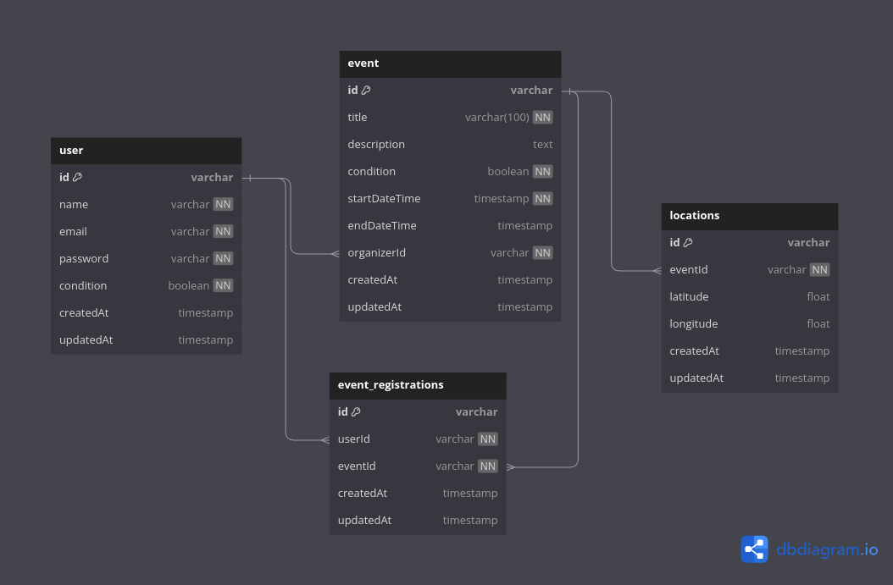

# Prueba Tecnica Coordinadora

1. Clonar proyecto ```git clone https://github.com/R-Berrocal/prueba-tecnica-coordinadora.git```
2. Clonar el archivo ```.env.template``` y renombrarlo a ```.env```
3. Genera tu token de mapbox y reemplazalo en la variable MAPBOX_ACCESS_TOKEN
4. Levantar la api
```
docker compose build --no-cache
```
```
docker compose up -d
```
5. conectate a tu base de datos con las credenciales
```
DATABASE_NAME = events-db
DATABASE_USER = postgres
DATABASE_PASSWORD = postgres
DATABASE_HOST = localhost
DATABASE_PORT = 5432
```
6. Ejecuta el script init.sql en tu gestor de base de datos postgres si accedes al ```http://localhost:5050``` te encontrarás con un contenedor que está corriengo el gestor pgadmin4 que te puede ayudar con esta tarea las credenciales son:

```
EMAIL: test@coordinadora.com
PASSWORD: admin
```

7. Puede probar la api dirigiendose a la documentación en el siguiente endpoint
```
http://localhost:3000/api/docs/
```

## Notas:

1. Video de explicacion de la solucion y ejecución del reto
```
https://drive.google.com/drive/folders/1SrCVZ9oZiV3i07vzHaL_UkfIqlYi_Sg9?usp=sharing
```

2. El archivo ```init.sql``` se usa para reconstruir tus tablas y agregar algunos registros de prueba

3. El usuario de prueba que puedes usar para iniciar sesion al seguir todos los pasos anteriores
```
{
    "email":"test@test.com",
    "password":"123456"    
}
```

4. El archivo ```events-template.xlsx``` se usa para probar el endpoint
```
METHOD: POST
/api/events/load
```
5. El archivo ```events-assistants.json``` se usa para enviar en el body toda la información necesaria para ejecutar el endpoint
```
METHOD: POST
/api/events/assistantsByDay
```

6. Modelo Relacional de la base de datos

